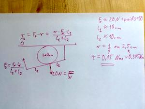

# Goal

**The aim of the RECOVID project** is to develop an open source VAC with all contributions being under MIT/CC license allowing other to copy, replicate, derive similar VACs. We try selecting components that are either readily available in hospitals or in FabLabs, to make it as easy as possible to replicate the design. The design is driven by requirements provided by emergency professionals, and aim to make the usage of the device easy and familiar for them.

We hope that if our design is successful, it will be replicated by others.

    
    <video src="video/20200409_170111.mp4" width="960" height="400" controls preload></video>

# Notre objectif ?

Avec le pic épidémique, les hôpitaux risquent de manquer de respirateurs (machines de Ventilation Assistée Controlée).

L’idée est de partir des respirateurs manuels et de produire une solution pour les mécaniser avec un bras mécanique et de l’électronique.

* Nous souhaitons proposer une **solution open-source & open hardware** pour fabriquer des machines de VAC d’urgence.

* En donnant les codes sources et les schémas aux fablabs et Maker de France, nous serions en capacité de refaire d'autres pièces et équipements.

**Le service de réanimation du CHU Grenoble nous aide à valider le prototype, et, une entreprise de la région Auvergne-Rhones-Alpes contribue au projet en concevant une version certifié et produire une première série pour le CHU.**

# Contexte et besoin

> 20 Mars 2020 : Manque de respirateurs sur la région Auvergne Rhônes-Alpes

Les différents acteurs de la santé projettent un besoin proche de 50000 respirateurs alors que les autorités sanitaires ont recensés 30000 équipements disponibles sur la France.

Le responsable des urgences du CHU de Grenoble, confirme cet état de fait; il doit faire face à l’afflux de malades de plus en plus nombreux, dans des états sévères qui requiert l'utilisation de respirateurs.  

Au vu de l'augmentation de patients en état critiques, il manquera des ventilateurs/respirateurs d'ici 3 semaines (il faudra doubler le nombre de lit disponibles d'ici les prochains jours', passer d’environ 100 lits à 200 lits sous 10 jours pour le CHU de Grenoble).

Le responsable des Urgences souhaite une production de 100 respirateurs (dans le cadre d’un essai clinique) à mettre à disposition du CHU progressivement dans les prochaines semaines.

**Il faut réunir toutes les forces en présence si nous voulons réussir: Laboratoires de recherche, Fablab/Makers, Industriels, PMEs, Artisans, et les citoyens qui ont eux aussi des compétences et un savoir faire à apporter.**

# Open Source Design

> Une communauté et l'Open source comme accélérateur technologique

L'Open source et l'Open Hardware permet de faciliter l'accès et la fabrication des composants utiles pour fabriquer des respirateurs.  En donnant les codes sources et les schémas aux fablabs et Maker de France, nous serions en capacité de refaire une centaine de pièces.

De même, les licences choisies (MIT et CC) permettent à une entreprise de la région Auvergne-Rhones-Alpes de nous aider en concevant une version certifié (V2) et produire une première série.

Le fabriquant <unknown>, en acceptant de contribuer activement au projet, permet de poursuivre un chemin qui n'est pas habituelle:

* Allier un **design collaboratif et open source** avec une **production qui requiert étude clinique, standardisation de la fabrication**, selon les normes requiert par le meilleur de la santé,
* Obtenir un produit certifié (méthodologies ARISK, QARA, 60601).

L'entreprise adhère au principe de partage et de diffusion que nous nous sommes fixés, et le projet reste open source / open hardware avec les mêmes licences.

# Key Research Question

* What problem are you trying to solve?
* What technologies are you using?
* What challenges have you faced and how did you overcome them?
* What is the potential impact of the technology?

  Praesent ac adipiscing ullamcorper semper ut amet ac risus. Lorem sapien ut odio odio nunc. Ac adipiscing nibh porttitor erat risus justo adipiscing adipiscing amet placerat accumsan. Vis. Faucibus odio magna tempus adipiscing a non. In mi primis arcu ut non accumsan vivamus ac blandit adipiscing adipiscing arcu metus praesent turpis eu ac lacinia nunc ac commodo gravida adipiscing eget accumsan ac nunc adipiscing adipiscing lorem ipsum dolor sit amet nullam veroeros adipiscing.

