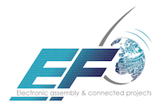
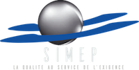

Recovid est avant tout un collectif de citoyens rassemblant des acteurs de différents milieux économiques et académiques Auvergne Rhône Alpes.

> All the people listed in this page contributed on the project at different level, there are important for us !

Ci dessous les contributeurs au projet. Ces personnes sont très importantes : **Elles ont permis de démarrer le projet**, obtenir un premier prototype fonctionnel en un temps record.

**Ils ont mis à notre disposition leurs savoir faire, leurs temps et énergies. Nous les remercions pour leurs engagements et l'ensemble du travail réalisé.**

# Partenaires du projet

|:--- |:--- |
|   |   |
|:--- |:--- |
|   |  |

### Experts domaine médical

* Urgentiste CHU (je ne met pas son nom pour limiter des solicitations)
* ``cyril FROMENTIN`` - a travaillé sur un VAC dans le passé
* ``ErikHuneker`` - réglementation dispositifs médicaux

### Relations institutions

* ``jerome`` - relation avec les institutions, dev IHM

### Relation communauté robotique Rhônes-Alpes Auvergne.

* ``Frédéric Helin`` - Il a joué le rôle de rabatteur de compétences (Robotique et association Coboteam - Thésame). Frédéric est aidé par le reste des membres du collectif pour trouver aussi des personnes.

### Prototype Inria
* ``sylefeb`` (Sylavain) - modélisation paramétrique
* ``Rix`` (Eric) - modélisation, motage, tests mécaniques, test du moteur NEMA 23

### Proto Alprobotic
``Benoît Alprobotic`` - motorisation, premiers test du ballon, proto chez Alprobotic

## Pressure sensors

* ``samuel.heidmann`` - sourcing et interface pour le capteur différenciel et absolu
* ``ludovic lm`` - vanne réglables low-tech

### Equipe Low-tech / DIY

* ``ludovic lm`` - vanne PEP sans commande low-cost, source de pression pour la commande de la PEP commandable avec une pompe d'air pour aquarium. motorisation : moteur essuie glace

### Développement logiciel embarquée

* ``Manoel Dahan`` s'occupe de coordonner la partie développement logiciel embarquée.
* ``Romain Delpoux`` regardent le code arduino pour les moteurs ...

### Firmware Arduino

* ``manO`` (Manoel) et son équipe commencent implémenter des fonctions de base du VAC

### IHM

* ``Germain`` et ``jerome`` développent l'interface d'utilisateur en Python sur RPi.
